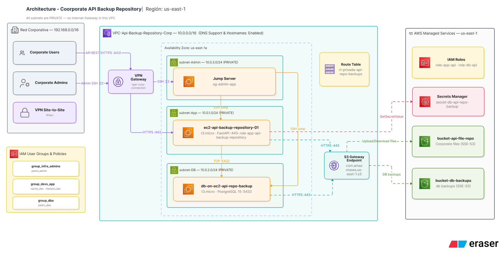

# Arquitectura — Backup Repository on AWS

Este documento define la arquitectura de una API corporativa interna, diseñada para transferir archivos a la nube (Amazon S3) y garantizar el respaldo (backup) de la información generada en el entorno on-premise.

- **API (EC2)** — API interna corporativa desplegada en una instancia EC2 sin IP pública, responsable de recibir archivos y subirlos a S3. Se optó por EC2 para garantizar una comunicación directa, privada y segura con el bucket de S3, aislando el tráfico de internet. Adicionalmente, la arquitectura demanda ejecución continua con tráfico sostenido en horario laboral y control total del entorno. Se dimensionó con una instancia t3.medium, logrando soportar el volumen de transferencia esperado.
- **S3** — Dos buckets: Uno almacena los archivos subidos por la API y
  otro guarda los backups de la base de datos. Se eligió S3 porque provee una plataforma de alta disponibilidad y durabilidad para almacenar la información.
  Es un servicio económico para backups y archivos poco frecuentemente accedidos. Tambien posee versionado que protege contra sobrescrituras o borrados accidentales.
- **Base de datos (EC2 + PostgreSQL)** — Una segunda instancia EC2, aislada en su propia subred,
  corre PostgreSQL y guarda los metadatos de los archivos (descripcion archivo, usuario, fecha de carga,etc) ; sus backups también se suben a S3.
- **Secrets Manager** — La contraseña de PostgreSQL se genera y guarda en un secret, y la
  instancia de la DB la recupera en runtime en vez de tenerla hardcodeada. Se eligió Secrets
  Manager porque el user-data de una instancia EC2 puede quedar expuestas las credenciales.
- **VPC / red** — Ambas instancias viven en subredes privadas dentro de una VPC dedicada, sin
  Internet Gateway; el acceso corporativo llega vía VPN Gateway y el tráfico a S3 sale por un
  VPC Endpoint, con Security Groups que restringen el tráfico entre capas (SG-to-SG). Se eligió
  esta topología porque el proyecto maneja archivos corporativos y sus backups, y solo el personal
  interno (vía la red on-prem) necesita alcanzar estos recursos; el VPC Endpoint evita el costo y
  la superficie de exposición de una NAT Gateway o un Internet Gateway.
- **IAM** — Cada instancia asume su propio rol de servicio (mínimo privilegio, sin access keys
  estáticas), separado de los grupos de usuarios humanos (administradores, desarrolladores, DBAs).
  Se eligió este modelo para poder auditar por separado qué hace cada máquina y cada persona, y
  para poder revocar el acceso de un usuario sin afectar el servicio en producción.

Todo corre sobre LocalStack/Docker (local-first) con AWS real como referencia, orquestado desde
`scripts/` (boto3) .

##
 Región (AWS Region)

Para el despliegue de esta infraestructura se ha seleccionado la región **US East (N. Virginia - us-east-1)**. 

La decisión se fundamenta principalmente en la optimización de costos. N. Virginia suele ofrecer los precios más competitivos dentro del ecosistema de AWS tanto para recursos de cómputo como de almacenamiento. Dado que el objetivo primordial del sistema es el resguardo (backup) masivo y la eventual recuperación de archivos, la latencia de red no es importante. Se descarto la seleccion de regiones mas cercanas como **Sao Paulo** dado que la latencia no es un factor crítico en la operación y los costos en US East son significativamente menores.

## Componentes

| Componente local                                     | Equivalente cloud   | Identidad / credencial                                                                                                                                              |
| ---------------------------------------------------- | ------------------- | ------------------------------------------------------------------------------------------------------------------------------------------------------------------- |
| **EC2** (`ec2-api-backup-repository-01`)             | Amazon EC2 (API)    | Rol`role-app-api-backup-repository` vía instance profile `instance-profile-api-backup-repository` (credenciales temporales STS, sin access keys)                   |
| **S3** (`bucket-api-file-repo`, `bucket-db-backups`) | Amazon S3           | Acceso desde`role-app-api-backup-repository` (`s3_read_policy.json` / `s3_write_policy.json`) y `role-db-api-backup-repository` (`s3_upload_backup_db_policy.json`) |
| **DB** (`db-on-ec2-api-repo-backup`)                 | RDS                 | Rol`role-db-api-backup-repository` vía instance profile `instance-profile-db-api-backup-repository`                                                                |
| **Secrets Manager** (`secret-db-api-repo-backup`)    | AWS Secrets Manager | Leído en runtime por la instancia DB vía rol`role-db-api-backup-repository` (`sm_read_secret_db.json`)                                                            |
| **VPC** (`VPC-Api-Backup-Repository-Corp`)           | Amazon VPC          | —                                                                                                                                                                  |
| **IAM** (grupos, usuarios y roles)                   | AWS IAM             | Grupos:`group_infra_admins` (`pedro_admin`), `group_devs_app` (`nacho_dev`, `mariano_dev`), `group_dba` (`pedro_dba`)                                               |

## Puntos únicos de falla identificados

| SPOF                                                                              | Mitigación en cloud                                                                           |
| --------------------------------------------------------------------------------- | ---------------------------------------------------------------------------------------------- |
| Base de datos PostgreSQL en una única instancia EC2 (sin réplica, sin Multi-AZ) | Migrar a Amazon RDS Multi-AZ                                                                  |
| Instancia EC2 de la API sin balanceo ni redundancia                               | Colocar la API detrás de un Auto Scaling Group + Application Load Balancer en múltiples      |
| Backups de S3 en una única región                                               | Habilitar replicación entre regiones (S3 Cross-Region Replication) para los buckets de backup |

## Decisiones de identidad

**Cómo se autentican los servicios entre sí:**

* Las instancias EC2 no usan access keys estáticas, asumen un rol IAM a través de su instance profile (`role-app-api-backup-repository` / `role-db-api-backup-repository`) y obtienen credenciales temporales de STS. El user-data de la DB llama a `aws secretsmanager get-secret-value` usando esas credenciales para obtener la contraseña de PostgreSQL en runtime.

**Quién/qué puede acceder a qué recurso:**

* Cada rol de servicio tiene permisos de mínimo privilegio y específicos de su función (la API lee/escribe en `bucket-api-file-repo` y lee el secret de la DB; la DB solo puede subir backups a `bucket-db-backups` y leer su propio secret).
* Los desarrolladores y admins se dividen en tres grupos IAM (`group_infra_admins`, `group_devs_app`, `group_dba`), cada uno con políticas acotadas a su función, separados por completo de los roles de servicio.
* A nivel de red, los Security Groups se referencian entre sí por ID (SG-to-SG) en vez de por IP: la DB solo acepta 5432 desde el SG de la app y SSH solo desde el SG administrativo/Jumper Server.

**Cómo se rotan las credenciales:**

* Las credenciales de los roles de servicio son temporales y las rota STS automáticamente; no hay claves de larga duración en las instancias.
* La contraseña de PostgreSQL vive en Secrets Manager (`secret-db-api-repo-backup`) y se reutiliza entre ejecuciones del script en lugar de regenerarse en cada corrida.
* Las access keys de los usuarios IAM (desarrolladores y admin)se generan una única vez por usuario y deben rotarse manualmente según la política de la organización.
