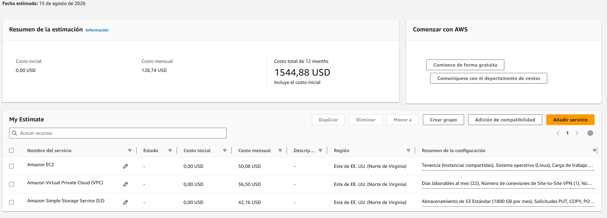

# Presupuesto Estimado

Este documento detalla el presupuesto estimado para mantener la infraestructura de la aplicacion **Api file backup repository** corriendo en AWS, basado en los componentes desplegados.

Todos los precios están estimados en Dólares Estadounidenses (USD) utilizando la región **US East (N. Virginia - us-east-1)**, bajo la modalidad de pago por uso (On-Demand) .

Se seleccionó la region us-east-1 por ser una region con precios competitivos y con gran cantidad de servicios disponibles.

## Parámetros de Estimación

Según los requerimientos del proyecto, la estimación se basa en:

- **Transferencia de Datos:** 
Se estiman 60 GB diarios (con un tope de 2000 GB al mes). Por la naturaleza del sistema de resguardo, proyectamos que el 90% de este volumen corresponderá a tráfico de entrada (Data In). 
El 10% restante se contempla como margen para tráfico de salida (Data Out), destinado exclusivamente a eventuales lecturas o restauraciones de archivos.

---

## Desglose de Costos por Componente

### 1. Amazon EC2 (Cómputo)
Se utilizan dos instancias para aislar la lógica de la API de la Base de Datos.
- **Instancia API (`t3.medium`):** 2 vCPUs, 4 GiB RAM. 
  - Costo: $0.0216/hora * 730 horas = **$15 / mes**
- **Instancia Database (`t3.medium`):** Para correr PostgreSQL.
  - Costo: $0.0216/hora * 730 horas = **$15 / mes**
- **Almacenamiento EBS (Discos):** 2 volúmenes `gp2` de 100 GB cada uno.
  - Costo: 200 GB * $0.10/GB = **$20 / mes**
- **Total Cómputo: $50 / mes**

### 2. Amazon S3 (Almacenamiento de Backups)
El core del proyecto, utilizando la capa estándar (S3 Standard).
- **Almacenamiento:** 2 TB (2,048 GB) * $0.020/GB = **$42.00 / mes**
- **Peticiones (PUT/COPY/POST):** Estimando unas 36.000 peticiones mensuales para almacenar los 1,200 archivos diarios.
  - Costo: 36.000 * ($0.005 / 1000) = **$0.18 / mes**
- **Total S3: $42.16 / mes**

### 3. Redes y Transferencia de Datos (VPC & VPN)

- **AWS Site-to-Site VPN Gateway:** 1 conexión activa 24/7.
  - Costo: $0.05/hora * 730 horas = **$36.50 / mes**
- **VPC Endpoint para S3:** Tipo *Gateway Endpoint*.
  - Costo: **$0.00 / mes** (Gratuito).

---

## Resumen del Presupuesto

| Categoría | Servicio AWS | Costo Estimado (USD / Mes) |
| :--- | :--- | :---: |
| **Cómputo** | Amazon EC2 + EBS | $50.00 |
| **Almacenamiento** | Amazon S3 | $42.16 |
| **Networking** | Site-to-Site VPN + Egress | $36.50 |
| **Total Estimado Mensual** | | **$128.66** |

### Proyección Anual
* Costo Estimado Mensual: **$128.74**
* Costo Estimado Anual (12 Meses): **$1,544.88**

##

### Oportunidades de Optimización a Futuro
Para reducir esta factura en el futuro sin sacrificar arquitectura, se recomienda:
1. **S3 Lifecycle Policies:** Configurar reglas para mover los backups más antiguos de S3 Standard a capas más y económicas (como S3 Glacier Deep Archive).
2. **Savings Plans:** Comprometerse a 1 o 3 años para las instancias EC2 puede reducir el costo de cómputo.
