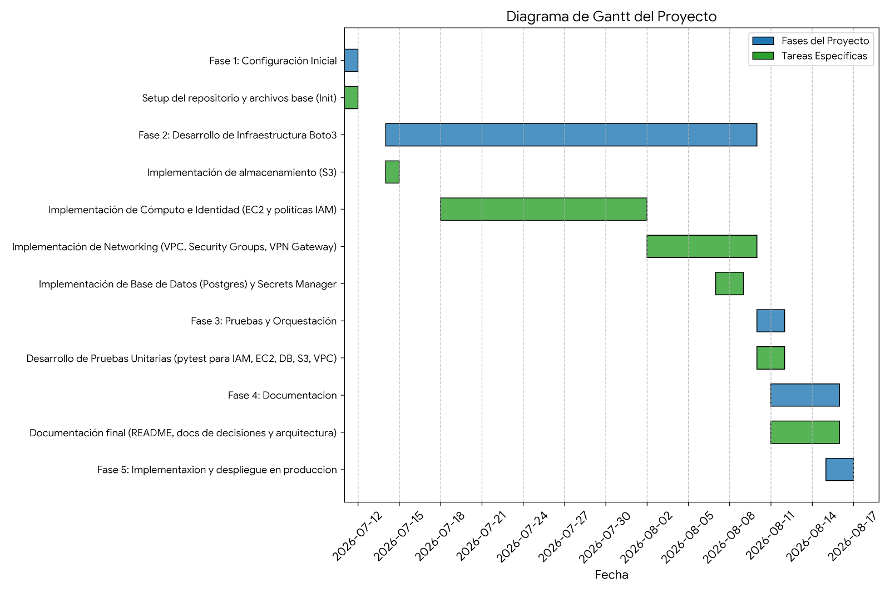

# Planificación del Proyecto (Diagrama de Gantt)

Este documento detalla la planificación temporal del proyecto de despliegue de infraestructura en AWS mediante Boto3. 

## Detalles del Recurso Contratado y Esfuerzo

El proyecto fue ejecutado bajo las siguientes restricciones y capacidades de recursos:

* **Rol asignado:** 1 Ingeniero Cloud Ops.
* **Dedicación:** Parcial (2 horas por día laborable).
* **Días laborables:** Lunes a Viernes (fines de semana excluidos).
* **Esfuerzo semanal:** 10 horas reales de trabajo.
* **Esfuerzo total:** ~40 horas de progreso neto distribuidas a lo largo de un mes.

## Cronograma

El siguiente cronograma refleja las fechas reales de construcción y despliegue iterativo de cada uno de los componentes de la infraestructura.

| ID Tarea | Nombre de Tarea                                                     | Duración en días (Aprox) | Fecha Inicio | Fecha Fin | Predecesora |
|----------|---------------------------------------------------------------------|--------------------------|--------------|-----------|-------------|
| 1.0      | Fase 1: Configuración Inicial                                       | 1                        | 11/7/2026    | 11/7/2026 |             |
| 1.1      | Setup del repositorio y archivos base (Init)                        | 1                        | 11/7/2026    | 11/7/2026 | -           |
| 2.0      | Fase 2: Desarrollo de Infraestructura Boto3                         | 27                       | 14/7/2026    | 9/8/2026  |             |
| 2.1      | Implementación de almacenamiento (S3)                               | 1                        | 14/7/2026    | 14/7/2026 | 1.1         |
| 2.2      | Implementación de Cómputo e Identidad (EC2 y políticas IAM)         | 15                       | 18/7/2026    | 1/8/2026  | 2.1         |
| 2.3      | Implementación de Networking (VPC, Security Groups, VPN Gateway)    | 8                        | 2/8/2026     | 9/8/2026  | 2.2         |
| 2.4      | Implementación de Base de Datos (Postgres) y Secrets Manager        | 2                        | 7/8/2026     | 8/8/2026  | 2.3         |
| 3.0      | Fase 3: Pruebas y Orquestación                                      | 2                        | 10/8/2026    | 11/8/2026 |             |
| 3.1      | Desarrollo de Pruebas Unitarias (pytest para IAM, EC2, DB, S3, VPC) | 2                        | 10/8/2026    | 11/8/2026 | 2.4         |
| 4.0      | Fase 4: Documentacion                                               | 5                        | 11/8/2026    | 15/8/2026 |             |
| 4.1      | Documentación final (README, docs de decisiones y arquitectura)     | 5                        | 11/8/2026    | 15/8/2026 | 3.1         |
| 5.0      | Fase 5: Implementaxion y despliegue en produccion                   | 1                        | 15/8/2026    | 16/8/2026 | 3.1         |

# Diagrama de Gantt

